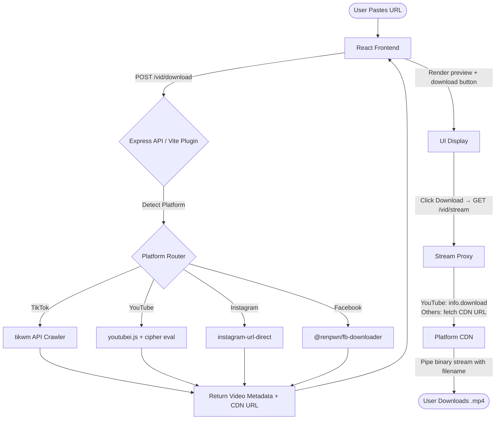

# 🎬 Video Downloader 2.0

A high-performance, **multi-platform HD video downloader** with a modern React frontend and a robust Express proxy API. Download videos from **YouTube**, **TikTok**, **Instagram**, and **Facebook** — all from a single, beautiful interface.

[](https://www.typescriptlang.org/)
[](https://react.dev/)
[](https://nodejs.org/)
[](https://pnpm.io/)
[](https://opensource.org/licenses/MIT)

---

## ✨ Key Features

| Platform | How It Works | Status |
|----------|-------------|--------|
| 🎵 **TikTok** | Watermark-free HD download via REST crawler | ✅ Working |
| ▶️ **YouTube** | `youtubei.js` with built-in cipher deciphering & stream download | ✅ Working |
| 📸 **Instagram** | Reel/video extraction via `instagram-url-direct` | ✅ Working |
| 📘 **Facebook** | Reel/video extraction via `@renpwn/fb-downloader` (SD + HD) | ✅ Working |

### Additional Highlights

- **Direct Stream Proxying** — Express proxies video downloads from secure CDNs directly to the browser, preventing CORS issues and link expiration
- **Modern UI** — Stunning glassmorphic design with Radix UI, Lucide React, Framer Motion, and Tailwind CSS 4
- **Platform Auto-Detection** — Paste any supported URL and the app automatically detects the platform
- **Robust Monorepo** — Fully typed TypeScript monorepo with `pnpm` workspaces and shared type safety across all packages
- **Optional Database** — PostgreSQL + Drizzle ORM for download history & video caching (works without it too)

---

## 🛠️ Tech Stack

| Layer | Technology |
|-------|-----------|
| **Monorepo** | pnpm workspaces |
| **Backend** | Node.js 24 + Express 5 + TypeScript 5.9 |
| **Frontend** | Vite 7 + React 19 + Tailwind CSS 4 |
| **UI Components** | Radix UI + Lucide React + Framer Motion |
| **State/Fetching** | TanStack React Query + Wouter (routing) |
| **API Contracts** | OpenAPI spec → Orval (auto-generated Zod schemas + React Query hooks) |
| **Database** | PostgreSQL + Drizzle ORM *(optional)* |
| **Video Extraction** | `youtubei.js` (YT) · `tikwm` API (TikTok) · `instagram-url-direct` (IG) · `@renpwn/fb-downloader` (FB) |
| **Deployment** | Vercel (frontend) + Render (backend) |

---

## 📂 Architecture & Directory Structure

```
Video-Downloader/
├── artifacts/
│   ├── api-server/                # Express API Server (production backend)
│   │   ├── src/
│   │   │   ├── routes/
│   │   │   │   ├── video.ts       # Core download/stream endpoints
│   │   │   │   └── health.ts      # Health check endpoint
│   │   │   ├── middlewares/        # CORS, logging, error handling
│   │   │   └── app.ts             # Server entry point
│   │   └── build.mjs              # esbuild bundling script
│   ├── tiktok-downloader/         # Main frontend web client
│   │   ├── src/
│   │   │   ├── components/        # Reusable UI components (buttons, cards, etc.)
│   │   │   ├── pages/
│   │   │   │   └── home.tsx       # Main download page (all 4 platforms)
│   │   │   └── main.tsx           # React mount entry
│   │   ├── api-plugin.ts          # Vite dev server middleware (proxies API locally)
│   │   └── vite.config.ts         # Client build & dev configuration
│   └── mockup-sandbox/            # UI/UX prototyping sandbox
├── lib/
│   ├── api-spec/                  # OpenAPI specification (openapi.yaml)
│   ├── api-zod/                   # Zod validation schemas (auto-generated)
│   ├── api-client-react/          # React Query hooks (auto-generated via Orval)
│   └── db/                        # Drizzle ORM schema & database client
├── scripts/                       # Workspace helper scripts
├── package.json                   # Root workspace config
├── pnpm-workspace.yaml            # pnpm workspace definition
└── tsconfig.base.json             # Shared TypeScript configuration
```

### Request Lifecycle



---

## 💻 Getting Started

### Prerequisites

- **Node.js** 24 or higher
- **pnpm** 10 or higher ([install guide](https://pnpm.io/installation))
- **Git**

> **Note:** PostgreSQL is **not required** for local development. The database features (download history, video caching) are optional and disabled when `DATABASE_URL` is not set.

### 1. Clone the Repository

```bash
git clone https://github.com/ren0777/Video-Downloader.git
cd Video-Downloader
```

### 2. Install Dependencies

```bash
pnpm install
```

### 3. Build Libraries

Compile shared TypeScript libraries (Zod schemas, API client, DB types):

```bash
pnpm run build
```

### 4. Start the Development Server

The frontend Vite dev server includes a built-in API middleware, so you **don't need to run the backend separately** during development:

```bash
pnpm --filter @workspace/tiktok-downloader run dev
```

Open [http://localhost:3000](http://localhost:3000) in your browser.

### 5. (Optional) Start the Standalone API Server

Only needed if you're testing the production backend independently:

```bash
pnpm --filter @workspace/api-server run dev
```

Runs on port `5000` by default.

---

## ⚙️ Environment Variables

### Required

| Variable | Description | Default |
|----------|-------------|---------|
| `PORT` | Server listening port | `3000` (frontend) / `5000` (API) |
| `BASE_PATH` | Base route path for client apps | `/` |

### Optional

| Variable | Description | Default |
|----------|-------------|---------|
| `DATABASE_URL` | PostgreSQL connection string | *Not set* (DB features disabled) |
| `NODE_ENV` | Environment mode | `development` |

> **Tip:** The app works perfectly without a database. Setting `DATABASE_URL` enables download history logging and video metadata caching for faster repeat lookups.

---

## 🚀 Deployment

### Frontend → Vercel

1. Connect your GitHub repo to [Vercel](https://vercel.com)
2. Set the **Root Directory** to `artifacts/tiktok-downloader`
3. Set **Build Command**: `cd ../.. && pnpm install && pnpm run build && pnpm --filter @workspace/tiktok-downloader run build`
4. Set **Output Directory**: `dist`
5. Add environment variable:
   - `VITE_API_URL` = your Render backend URL (e.g., `https://your-api.onrender.com`)

### Backend → Render

1. Create a new **Web Service** on [Render](https://render.com)
2. Connect your GitHub repo
3. Set **Build Command**: `pnpm install && pnpm run build && pnpm --filter @workspace/api-server run build`
4. Set **Start Command**: `node artifacts/api-server/dist/index.mjs`
5. Add environment variables:
   - `PORT` = `5000`
   - `NODE_ENV` = `production`
   - `DATABASE_URL` = *(optional)* your PostgreSQL connection string

### Optional: PostgreSQL on Render

1. Create a free **PostgreSQL** instance on Render
2. Copy the **Internal Database URL**
3. Set it as `DATABASE_URL` in your Web Service environment
4. The app will automatically create tables on first run

---

## 🔧 Available Commands

| Command | Description |
|---------|-------------|
| `pnpm install` | Install all workspace dependencies |
| `pnpm run build` | Typecheck + build all packages |
| `pnpm run typecheck` | Run TypeScript type checking across all packages |
| `pnpm --filter @workspace/tiktok-downloader run dev` | Start frontend dev server (port 3000) |
| `pnpm --filter @workspace/api-server run dev` | Start backend API server (port 5000) |
| `pnpm --filter @workspace/mockup-sandbox run dev` | Start UI sandbox (port 5173) |

---

## 🏗️ How Each Platform Works

### YouTube

Uses [`youtubei.js`](https://github.com/LuanRT/YouTube.js) v17 with an automated cipher evaluator to parse YouTube's Innertube API. For streaming, the library's built-in `info.download()` method is used, which handles Google CDN authentication and signature validation internally — avoiding the 403 errors that occur with bare `fetch()` calls to deciphered URLs.

### TikTok

Uses the `tikwm` REST API to fetch watermark-free HD video URLs. The CDN URLs are then proxied through the Express stream endpoint for direct download.

### Instagram

Uses [`instagram-url-direct`](https://www.npmjs.com/package/instagram-url-direct) v2 to extract direct video URLs from Instagram Reels and posts. Returns metadata including likes, comments, and video dimensions.

### Facebook

Uses [`@renpwn/fb-downloader`](https://www.npmjs.com/package/@renpwn/fb-downloader) to extract both SD and HD video URLs from Facebook Reels and Watch videos.

---

## 🛡️ Troubleshooting

### Windows: `Cannot find module @rollup/rollup-win32-x64-msvc`

**Cause:** Aggressive platform exclusions in `pnpm-workspace.yaml` block Windows native engines.

**Fix:** Ensure win32-x64 overrides are commented out in `pnpm-workspace.yaml`, then run `pnpm install`.

### Windows: `sh` command not found

**Cause:** Some monorepos use `sh -c` in preinstall hooks which fails on PowerShell/CMD.

**Fix:** This repo uses `npx only-allow pnpm` which works cross-platform (Windows, macOS, Linux).

### YouTube: Parser warnings in console

**Cause:** `youtubei.js` v17.0.1 logs `TicketShelf not found` and `MenuCustomIconItem` parsing errors. These are **cosmetic warnings** from YouTube's evolving API — they do not affect video downloads.

**Fix:** No action needed. The library auto-generates runtime classes for unknown types.

### Missing `PORT` or `BASE_PATH` environment variables

**Cause:** Building or running Vite without environment values set.

**Fix:** Default values are configured in each `vite.config.ts` as fail-safes. No manual setup required for local development.

### Database connection errors

**Cause:** `DATABASE_URL` is set but points to an unreachable PostgreSQL instance.

**Fix:** Either:
- Remove `DATABASE_URL` to disable database features entirely
- Or ensure your PostgreSQL instance is running and accessible

---

## 📄 License

This project is licensed under the [MIT License](LICENSE).

---

<p align="center">
  <b>Built with ❤️ by <a href="https://github.com/ren0777">ren0777</a></b>
</p>
